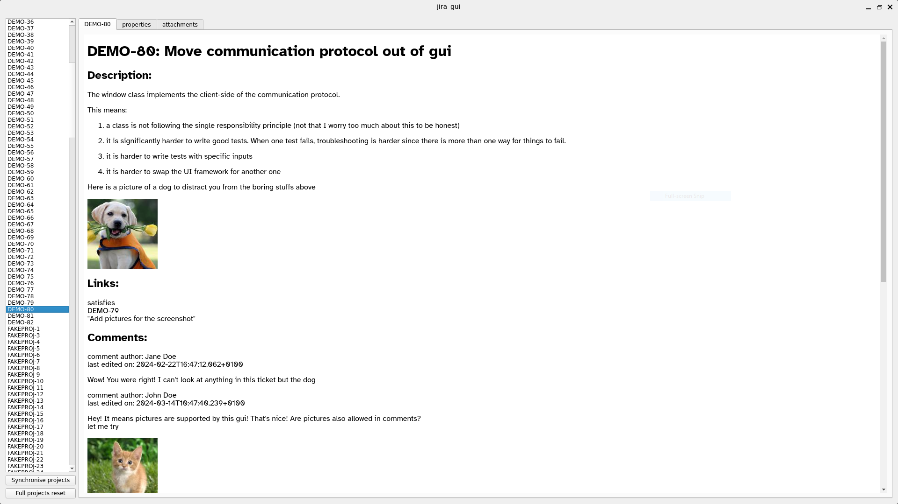
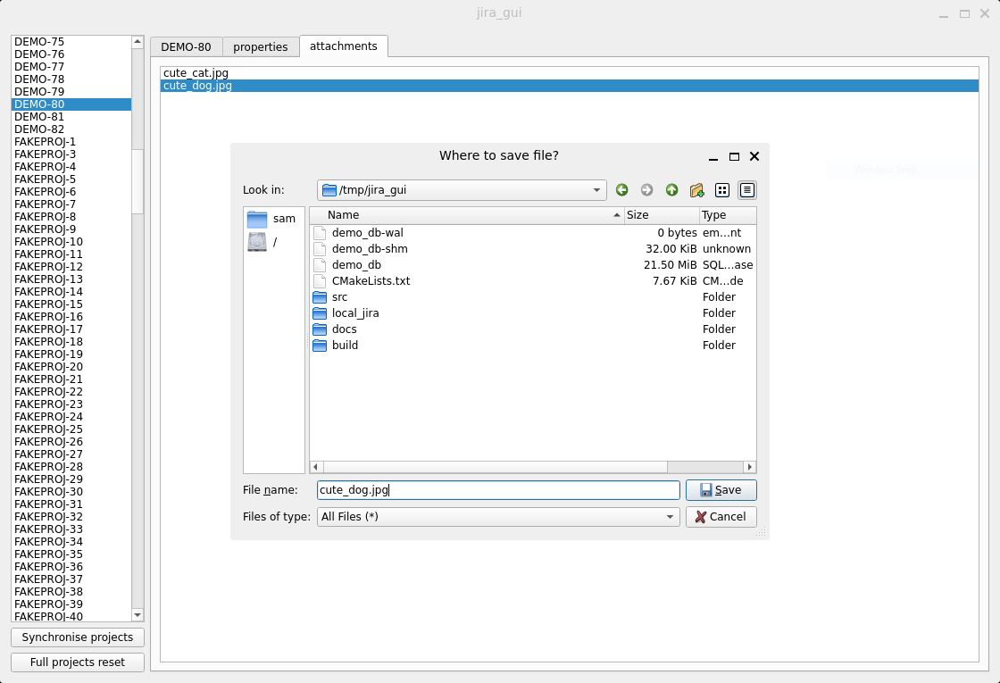

JIRA_GUI
=======

This project is a gui for [local_jira](https://codeberg.org/s-d-m/local_jira). It allows to easily view jira tickets which
are saved and synchronised locally by `local_jira`

How it looks
=====

As a small teaser, the UI looks like the following:


The UI is simple and is made of a panel containing the list of tickets on the left. Clicking on one them displays the tickets and
comments on the main central widget. At the top of the window, the UI has some tabs on the top which lets the see the list of key
value properties of a ticket, or the list of files attached to one. The tab with attachments shows the files attached to a ticket.
Note that a file attached as part of a ticket to a ticket shows as belonging to the ticket. Double clicking on a file let's the
user save it on the disk as can be seen in the screenshot below:



At the bottom left, the `synchronise projects` button let's the user resynchronise the local database with the remote server.
This synchronises the tickets that were modified or added since the last synchronisation point.

The `full projects reset` does something similar but using much slower algorithm and more correct. For example, if a user
didn't have access to an old specific ticket, at the last synchronisation point, but does have access now, clicking 
`synchronise projects` won't make that ticket appear in the list; clicking `full projects reset` will;

How to build
=====

*TL;DR:*
This works on linux and you need to install:
- [Qt >= 6.7](https://www.qt.io/download-open-source) and make it available in your `PATH`,
- `g++ >= 13`
- `cmake`
- `ninja`
- [rust toolchain](https://www.rust-lang.org/tools/install)
- [git (for initial clone)](https://git-scm.com/book/en/v2/Getting-Started-Installing-Git)

On debian and ubuntu, g++, cmake, ninja, and git can be installed using
```shell
> sudo apt install cmake g++ git ninja-build
```
The rust toolchain and qt might need to be installed separately.

Then, building it is a simple matter of:
```shell
> git clone --recurse-submodules `https://codeberg.org/s-d-m/jira_gui`
> mkdir jira_gui/build
> PATH="/path/to/qt/installation/6.7/gcc_64/libexec/:/path/to/qt/installation/6.7/gcc_64/libexec/:${PATH}" cmake -S jira_gui -B jira_gui/build -DCMAKE_BUILD_TYPE=Release
> ninja -v -C jira_gui/build
```
If all is successful, the binary will be at `jira_gui/build/src/jira_gui` and can be executed directly.

How to use
=====

The `GUI` automatically starts `local_jira` which is configured via a file. To configure `local_jira`, create a file
at `/home/<user>/.config/local_jira/local_jira.toml` with the following content

```toml
# Example configuration file

server_address = "https://<acme-company.com>:80"
user_login = "Your.Name@acme-company.com" # likely your company's email address
api_token = "<API TOKEN>" # see jira documentation to find out how to export it
# alternatively use JIRA_API_TOKEN=<API_TOKEN> as environment variable to pass the token

# Path to the database. This is the place where the tickets are served locally.
# When not given, a default path is used that is a file named local_jira.sqlite
# in the same folder as the configuration file.
local_database = "path to the database file"

# List of jira project keys you are interesting in. This is the name part in the jira ticket
# numbers. E.g. for a jira ticket COMPANYPROJECT-1234, the project key is COMPANYPROJECT
interesting_projects = [ "PRJKEYONE", "PRJKEYTWO", "PRJKEYTHREE" ]

# Unfortunately jira doesn't provide an option to download ticket attachments through
# an API using the JIRA_API_TOKEN. At least I didn't find a solution.
#  The workaround is instead to ask the user to log
# into jira using firefox, and provide the path to the cookie file containing the tenant
# session cookie. local_jira will retrieve that cookie and download attachment files
# with it. Without this cookie, No attachment file will be downloaded.
mozilla_cookies_db = "/Path/to/Mozilla/Firefox/Profiles/<profile key>/cookies.sqlite"
```

Restrictions
===

At the moment, `jira_gui` relies on `local_jira` to download and save jira tickets. `local_jira` was developed to fit my
needs and therefore, was only tested with on-cloud jira instances. On-premise instances were therefore not tested.

Also, links to a tickets belonging to projects outside of the projects managed by `local_jira` are not showned. This is
a (admittedly self-imposed) limitation of `local_jira`. Lifting this restriction shouldn't be too much work though.

Initially, I was planning to allow editing jira tickets directly from the gui. This feature is at the moment not
implemented. Due to limited free-time, it is likely that I won't implement it anytime soon.

FAQ
====

### Error about `invokeMethod` when compiling
If the code fails to compile with errors saying:

```
No matching function for call to 'invokeMethod' candidate template ignored: [...]
```

you need to update Qt to at least 6.7, and make it available first in the path for cmake to find.
